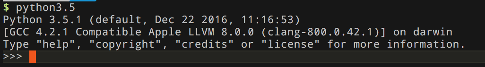

> 本项目为本人的 Python 自学笔记。根据《Python 基础教程（第二版 修订版）》所得总结。所使用的 Python 版本为 `3.5.1`


## 基础

### 安装 Python

### 交互式解释器

启动 Python 的时候，有如下提示：



写下第一个程序（或者执行`$ python source/basics/hello.py `）：

```python
>>> print("Hello, world!")
Hello, world!
```

> 行尾不需添加分号，这点不同于其他语言。如果一行有更多语句，需分号，但不建议这样的编程习惯。


### 数字和表达式

`source/basics/basics.py `

```python
# 导入模块
from math import floor
from math import sqrt
import cmath

# 导入模块
# 加法
print('123 + 234 = ' + str(123 + 234))

# 减法
print('111 - 11 = ' + str(111 - 11))

# 除法
print('10 / 3 = ' + str(10 / 3))

# 向下取整
print('10 // 3 = ' + str(10 // 3))

print('1.0 / 2.0 = ' + str(1.0 / 2.0))
print('1.0 // 2.0 = ' + str(1.0 // 2.0))

# 取余
print('1 % 2 = ' + str(1 % 2))

# 幂运算
print('2^3 = ' + str(2 ** 3))

# 十六进制
print(0xAF)

# 八进制
print(0o20)

# 变量 赋值
x = 10
# 获取用户输入
# y = input('输入一个整数数字 y = ')
y = 11
print('10 * y = ' + str(x * int(y)))

# 函数
print('-100的绝对值：' + str(abs(-100)))
print('3.0 / 2.0 浮点数四舍五入：' + str(round(3.0 / 2.0)))
print('2^3 = pow(2, 3)：' + str(pow(2, 3)))
print('1.8向下取整：' + str(floor(1.8)))
print('4的平方根：' + str(sqrt(4)))
print('-1的平方根：' + str(cmath.sqrt(-1)))

# 字符串前加上 r ，不转义
print('转义，hello, \nworld')
print(r'原始字符串，hello, \nworld')
```


## 列表和元组

Python中有6种内建的序列，最常用的两种：列表和元组。其他还有字符串、Unicode字符串、buffer对象和xrange对象。

列表可修改，元组不可修改，这是它们的区别。

* 序列 - `source/lists_tuples/indexing.py `

* 序列示例 - `source/lists_tuples/indexing_example.py`

* 相加 - `source/lists_tuples/adding_sequences.py`

* 乘法 - `source/lists_tuples/multiplication_sequences.py`

* 乘法示例 - `source/lists_tuples/multiplication_sequences.py`

* 分片 - `source/lists_tuples/slicing.py`

  ​

## 使用字符串


##  字典


## 条件、循环和其他语句


## 抽象


## 异常


## 魔术方法、属性和迭代器


## 自带电池


## 文件和流


## 图形用户界面


## 数据库支持


## 网络编程


## Python 和 Web


## 测试


## 扩展 Python


## 程序打包


