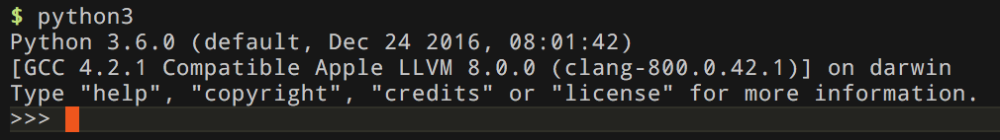

> 本项目为本人的 Python 自学笔记。根据《Python 基础教程（第二版 修订版）》所得总结。所使用的 Python 版本为 `3.6.0`


## 基础

### 安装 Python

### 交互式解释器

启动 Python 的时候，有如下提示：



写下第一个程序（或者执行`$ python source/basics/hello.py `）：

```python
>>> print("Hello, world!")
Hello, world!
```

> 行尾不需添加分号，这点不同于其他语言。如果一行有更多语句，需分号，但不建议这样的编程习惯。


### 数字和表达式

`source/basics/basics.py `

```python
# 导入模块
from math import floor
from math import sqrt
import cmath

# 导入模块
# 加法
print('123 + 234 = ' + str(123 + 234))

# 减法
print('111 - 11 = ' + str(111 - 11))

# 除法
print('10 / 3 = ' + str(10 / 3))

# 向下取整
print('10 // 3 = ' + str(10 // 3))

print('1.0 / 2.0 = ' + str(1.0 / 2.0))
print('1.0 // 2.0 = ' + str(1.0 // 2.0))

# 取余
print('1 % 2 = ' + str(1 % 2))

# 幂运算
print('2^3 = ' + str(2 ** 3))

# 十六进制
print(0xAF)

# 八进制
print(0o20)

# 变量 赋值
x = 10
# 获取用户输入
# y = input('输入一个整数数字 y = ')
y = 11
print('10 * y = ' + str(x * int(y)))

# 函数
print('-100的绝对值：' + str(abs(-100)))
print('3.0 / 2.0 浮点数四舍五入：' + str(round(3.0 / 2.0)))
print('2^3 = pow(2, 3)：' + str(pow(2, 3)))
print('1.8向下取整：' + str(floor(1.8)))
print('4的平方根：' + str(sqrt(4)))
print('-1的平方根：' + str(cmath.sqrt(-1)))

# 字符串前加上 r ，不转义
print('转义，hello, \nworld')
print(r'原始字符串，hello, \nworld')
```


## 列表和元组

Python中有6种内建的序列，最常用的两种：列表和元组。其他还有字符串、Unicode字符串、buffer对象和xrange对象。

列表可修改，元组不可修改，这是它们的区别。

* 序列 - `source/lists_tuples/indexing.py `

* 序列示例 - `source/lists_tuples/indexing_example.py`

* 相加 - `source/lists_tuples/adding_sequences.py`

* 乘法 - `source/lists_tuples/multiplication_sequences.py`

* 乘法示例 - `source/lists_tuples/multiplication_sequences.py`

* 分片 - `source/lists_tuples/slicing.py`

  ​

## 使用字符串

所有标准的序列操作（索引、分片、乘法、判断成员资格、求长度、取最小值和最大值）对字符串同样适用。但是，字符串都是不可变的。因此，以下项或分片赋值都是不合法的。

```python
>>> website = 'http://www.python.org'
>>> website[-3:] = 'com'
Traceback (most recent call last):
  File "<pyshell#19>", line 1, in ?
    website[-3:] = 'com'
TypeError: object doesn't support slice assignment
```

* 字符串格式化：精简版 - `source/strings/formatting_short.py`

* 字符串格式化：完整版 - `source/strings/formatting_long.py`

* 字符串格式化示例 - `source/strings/formatting_example.py`

* 字符串方法 - `source/strings/string_methods.py`

  ​


##  字典

通过名字引用值的数据结构类型为映射。字典是Python唯一的内建的映射类型。

* 字典的使用 - `source/dictionaries/uses.py`

* 字典使用示例 - `source/dictionaries/example.py`

* 字典方法 - `source/dictionaries/methods.py`

  ​

## 条件、循环和其他语句


### 把某件事作为另一件事导入

```python
import somemodule
# 或者
from somemodule import somefunction
# 或者
from somemodule import somefunction, anotherfunction, yetanotherfunction
# 或者
from somemodule import *
```

只有确定自己想要从给定的模块导入所有功能时，才应该使用最后一个版本。但是如果两个模块都有`open`函数，那又该怎么办？只需使用第一种方式导入，然后像下面这样使用函数：

```python
module1.open(...)
module2.open(...)
```

但还有另外的选择：可以在语句末尾增加一个as字句，在该字句后给出名字，或为整个模块提供别名：

```python
>>> import math as foobar
>>> foobar.sqrt(4)
2.0
```

也可以为函数提供别名：

```python
>>> from math import sqrt as foobar
>>> foobar(4)
2.0
```

对于open函数，可以像下面这样使用：

```python
from module1 import open as open1
from module2 import open as open2
```


* 赋值魔法 - `source/conditionals_loops_statements/assignment_magic.py`
* 条件与条件语句 - `source/conditionals_loops_statements/conditions_statements.py`
* 比较运算符

|    表达式     |         描述          |
| :--------: | :-----------------: |
|   x == y   |       x 等于 y        |
|   x < y    |       x 小于 y        |
|   x > y    |       x 大于 y        |
|   x >= y   |      x 大于等于 y       |
|   x <= y   |      x 小于等于 y       |
|   x != y   |       x 不等于 y       |
|   x is y   |    x 和 y 是同一个对象     |
| x is not y |    x 和 y 是不同的对象     |
|   x in y   | x 是 y 容器（例如，序列）的成员  |
| x not in y | x 不是 y 容器（例如，序列）的成员 |

* 循环 - `source/conditionals_loops_statements/loops.py`


## 抽象

* 创建函数 - `source/abstraction/creating_functions.py`
* 参数魔法 - `source/abstraction/parameters_magic.py`
* 闭包 - `source/abstraction/closure.py`
* 递归 - `source/abstraction/recursion.py`


## 更加抽象

* 一个类实例 - `source/more_abstraction/Person.py`
* 类的命名空间 - `source/more_abstraction/class_namespace.py`
* 类的私有属性 - `source/more_abstraction/privacy.py`
* 超类 - `source/more_abstraction/superclass.py`


## 异常

使用`raise`来引发异常。

第一个例子 raise Exception 引发了一个没有任何错误信息的普通异常。后一个例子中则添加了一些 hyperdive overload 错误信息。

```python
>>> raise Exception
Traceback (most recent call last):
  File "<stdin>", line 1, in ?
Exception
>>> raise Exception('hyperdrive overload')
Traceback (most recent call last):
  File "<stdin>", line 1, in ?
Exception: hyperdrive overload
```

内建异常类型很多。这些内建异常都可以在 exceptions 模块（和内建的命名空间）中找到。可以使用`dir`函数列出模块的内容。

```python
>>> import exceptions
>>> dir(exceptions)
['ArithmeticError', 'AssertionError', 'AttributeError', ...]
```

**一些内建异常**

|        类名         |                 描述                 |
| :---------------: | :--------------------------------: |
|     Exception     |              所有异常的基类               |
|  AttributeError   |            特性引用或赋值失效时引发            |
|      IOError      |        试图打开不存在文件（包括其他情况）时引发        |
|    IndexError     |          在使用序列中不存在的索引时引发           |
|     KeyError      |           在使用映射中不存在的键时引发           |
|     NameError     |           在找不到名字（变量）时引发            |
|    SyntaxError    |            在代码为错误形式时引发             |
|     TypeError     |       在内建操作或者函数应用于错误类型的对象时引发       |
|    ValueError     | 在内建操作或者函数应用于正确类型的对象，但是对象使用不合适的值时引发 |
| ZeroDivisionError |        在除法或者模除操作的第二个参数为0时引发        |


* 捕获示例 - `source/exceptions/catching_exceptions.py`

  ​

## 魔术方法、属性和迭代器

构造方法 - `source/magic_methods_properties_iterators/constructors.py`

基本的序列和映射规则 - `source/magic_methods_properties_iterators/item_access.py`**

序列和映射是对象的集合。为了实现它们基本的行为（规则），如果对象是不可变的，那么就需要使用两个魔术方法，如果是可变的则需要使用4个。

* `__len_(self)`：这个方法应该返回集合中所含项目的数量。对于序列来说，这就是元素的个数；对于映射来说，则是键值对的数量。如果`__len_`返回0（并且没有实现重写该行为的`__nonzero_`），对象会被当做一个布尔变量中的假值（空的列表，元组，字符串和字典也一样）进行处理。
* `__getitem_(self.key)`：这个方法返回与所给键对应的值。对于一个序列，键应该是一个`0~n-1`的整数（或者像后面所说的负数），n 是序列的长度；对于映射来说，可以使用任何种类的键。
* `__setitem_(self,key,value)`：这个方法应该按一定的方式存储和 key 相关的 value，该值随后可使用`__getitem_`来获取。当然，只能为可以修改的对象定义这个方法。
* `__delitem_(self,key)`：这个方法在对一部分对象使用 del 语句时被调用，同时必须删除和元素相关的键。这个方法也是为可修改的对象定义的（并不是删除全部的对象，而只删除一些需要移除的元素）。

属性 - `source/magic_methods_properties_iterators/properties.py`

静态方法和类成员方法 - `source/magic_methods_properties_iterators/static_class_methods.py`

迭代器 - `source/magic_methods_properties_iterators/iterators.py`

生成器 - `source/magic_methods_properties_iterators/generators.py`

八皇后 - `source/magic_methods_properties_iterators/the_eight_queens.py`


## 自带电池

* 简单的模块导入测试 - `source/batteries/hello.py` `source/batteries/hello_test.py`

使用列表推导式打印模块copy 不含下划线开头的名字列表。

```python
>>> [n for n in dir(copy) if not n.startswith('_')]
['Error', 'PyStringMap', 'copy', 'deepcopy', 'dispatch_table', 'error', 'name', 't']
```

`__all__`变量

```python
>>> copy.__all__
['Error', 'copy', 'deepcopy']
```

此变量告诉解释器：从模块导入所有名字代表什么含义。

```python
from copy import *
```

如果需要导入`PyStringMap`的话，就必须显式地实现，或者导入 `copy` 然后使用 `copy.PyStringMap`,或者使用 `from copy import PyStringMap`

**标准库**

* sys：通过该模块可以访问到多个和 Python 解释器联系紧密的变量和函数。
* os：通过该模块中的函数可以产生随机数、从序列中选取随机元素以及打乱列表元素。
* fileinput：通过该模块可以轻松遍历多个文件和流中的所有行。
* sets、heapq 和 deque：这3个模块提供了3个有用的数据结构。集合也以内建的类型 set 存在。
* time：通过该模块可以获取当前时间，并可进行时间日期操作和格式化。
* random：通过该模块中的函数可以产生函数、从序列中选取随机元素以及打乱列表元素。
* shelve：通过该模块可以创建持续性映射，同时将映射的内容保存在给定文件名的数据库中。
* re：支持正则表达式的模块。


## 文件和流

使用`open`打开文件。`open`函数中模式参数的常用值。

| 值    | 描述                 |
| ---- | ------------------ |
| 'r'  | 读模式                |
| 'w'  | 写模式                |
| 'a'  | 追加模式               |
| 'b'  | 二进制模式（可添加到其他模式中使用） |
| '+'  | 读/写模式（可添加到其他模式中使用） |

**管道输出** - `source/files_stuff/counts_words.py`

```sh
cat hello.txt| python counts_words.py 
```

读一行使用`file.readline`

字节操作 - `source/files_stuff/byte_by_byte.py`


## 图形用户界面

**一些支持 Python 的流行 GUI 工具包**

|    工具包     | 描述                                     | 网站                                       |
| :--------: | -------------------------------------- | ---------------------------------------- |
|  Tkinter   | 使用 Tk 平台，很容易得到，半标准。                    | http://wiki.python.org/moin/TkInter      |
|  wxpython  | 基于 wxWindows，跨平台越来越流行。                 | http://wxpython.org                      |
| Python Win | 只能在 Windows 上使用，使用了本机的 Windows GUI 功能。 | http://starship.python.net/crew/mhammond |
| Java Swing | 只能用于 Jython，使用本机的 Java GUI             | http://java.sun.com/docs/books/tutorial/uiswing |
|   PyGTK    | 使用 GTK 平台，在 Linux 上很流行                 | http://pygtk.org                         |
|    PyQt    | 使用 Qt 平台，跨平台。                          | http://wiki.python.org/moin/PyQt         |

* 窗口和组件 - `source/gui/windows_components.py`

* 智能布局 - `source/gui/intelligent_layout.py`

* 最终示例 - `source/gui/final_gui.py`

  ​

## 数据库支持


## 网络编程


## Python 和 Web


## 测试


## 扩展 Python


## 程序打包


